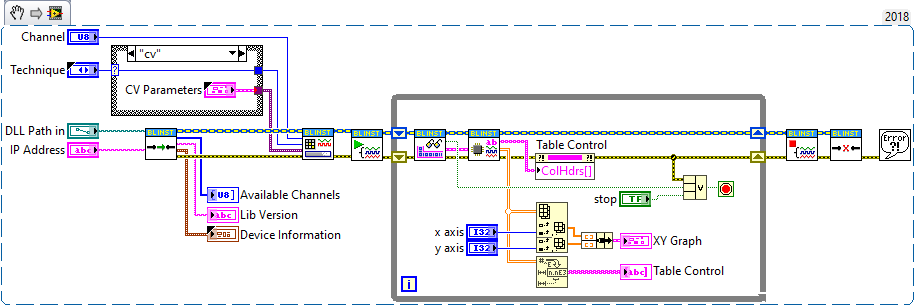
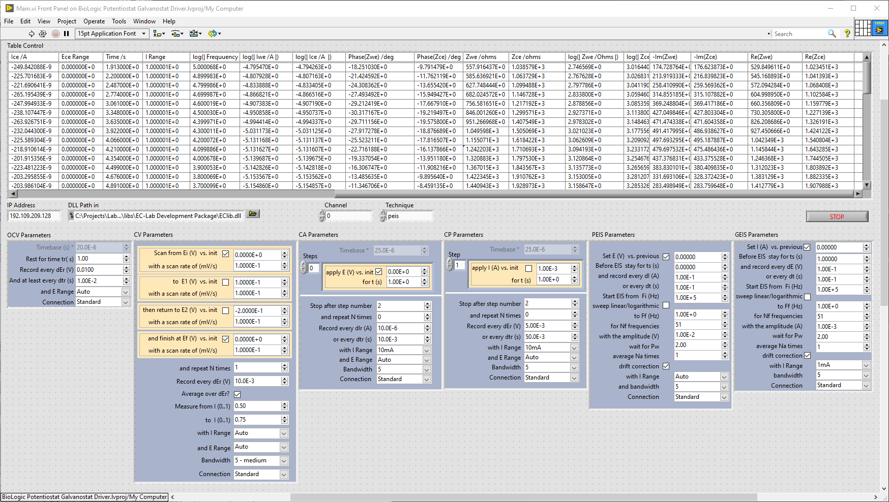
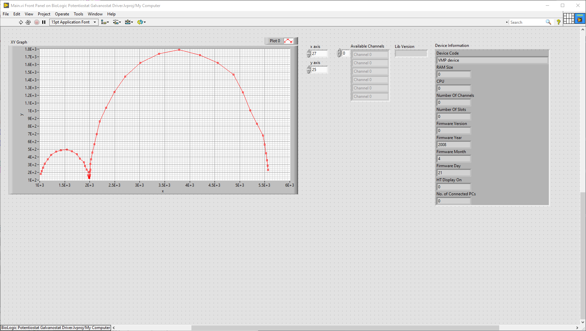

# Unofficial LabVIEW Driver for EC-Lab BioLogic Potentiostats
Unoffcial LabVIEW driver for BioLogic potentiostats/galvanostats designed for ease of intergration to LV projects. I stress that this is designed for intergration and thus it is not a complete LabVIEW out of the box solution. This means you will been the [EC-Lab OEM Development Package](https://www.biologic.net/support-software/ec-lab-oem-development-package/) along side you as well as an understanding of the documentation to get up and running. 

With that said, getting started is fairly straightforward. The driver follows this pattern:

<b> Connect ➡ Load Technique ➡ Start ➡ Acquire Data ➡ Process Data ➡ Stop ➡ Disconnect</b>

You can open the Main.vi VI to see an example of how it works at a higher level.

**Connect.vi** handles initalisation and connects to the instrument.

Loading a Technique is also fairly simple. Just connect the type-def associated with the technique you wish to use to the Technique Parameters in terminal of the **Load Technique.vi** VI and selected you technique on the enum. The **Load Technique.vi** VI will check to see if you connected a valid and supported technique then format the parameters accordingly, if the check is passed. If not it will produce an error which will propagate through the error wire. 

**Start Channel.vi** starts the aquisition on the specified channel.

The **Acquie Data.vi** VI will give return the channel data with minimal processing. This data had to read unless you have the documents located on the [EC-Lab OEM Development Package](https://www.biologic.net/support-software/ec-lab-oem-development-package/) . The output is a cluster containing the meta-data for the data, Current Values and Process Data. This is for you to implement you own custom processing solution. There is a built-in processing solution in the form of a VI called **Process Data.vi**. This VI will not only output the column header text but with will do additional maths such as producing extra columns for -Im(Z) and Re(Z) used for Nyquist plots in the PEIS technique.

**Stop Channel.vi** stops the aquisition on the specified channel.

**Disconnet.vi** cleans and disconnects the instrument.

**Note:** Not all devices and techniques are supported.

# Minimum Requirements
* LabVIEW 2018 (32/64 bit)
* [EC-Lab OEM Development Package](https://www.biologic.net/support-software/ec-lab-oem-development-package/)

# Supported Techniques
* OCV - Open Circuit Voltage
* CV - Cyclic Voltammetry
* CA - Chronoamperometry
* CP - Chronopotentiometry
* PEIS - Potentio Electrochemical Impedance Spectroscopy
* GEIS - Galvano Electrochemical Impedance Spectroscopy

# Supported Devices

* VMP3 series - theoretically should be supported
* SP-300 series - not supported, a little extra work in needed to add support for these. The Connect.vi VI will detect these and produce an error. 

# Developer Notes

Please feel free to contribute to the project. For unsupported Techniques/Devices I am happy to try and add them on request. However, I will do this on my spare time and will not adhere to any deadlines, nor will I accept any form of payment.

# Code Snippets

 **Main.vi:**

- - - -
