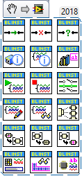
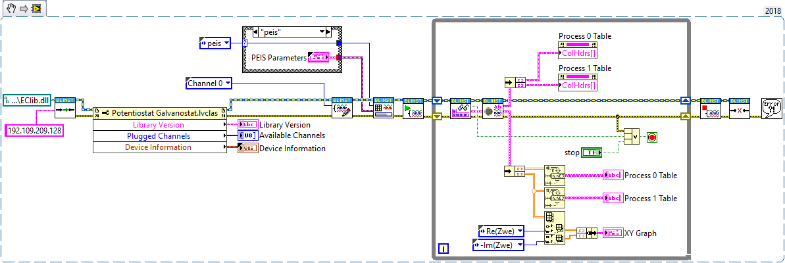
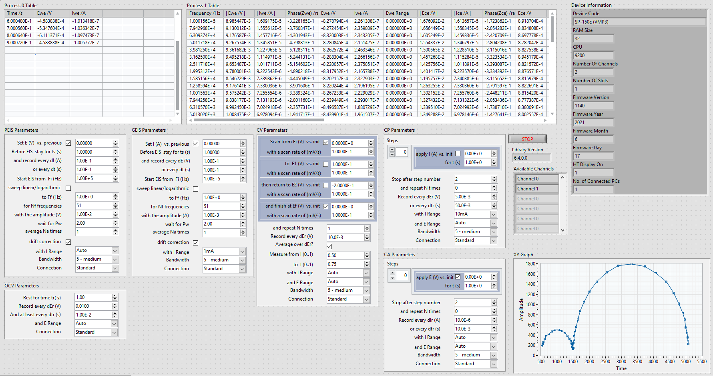
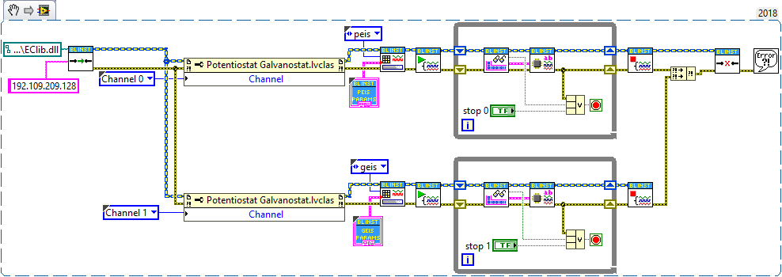
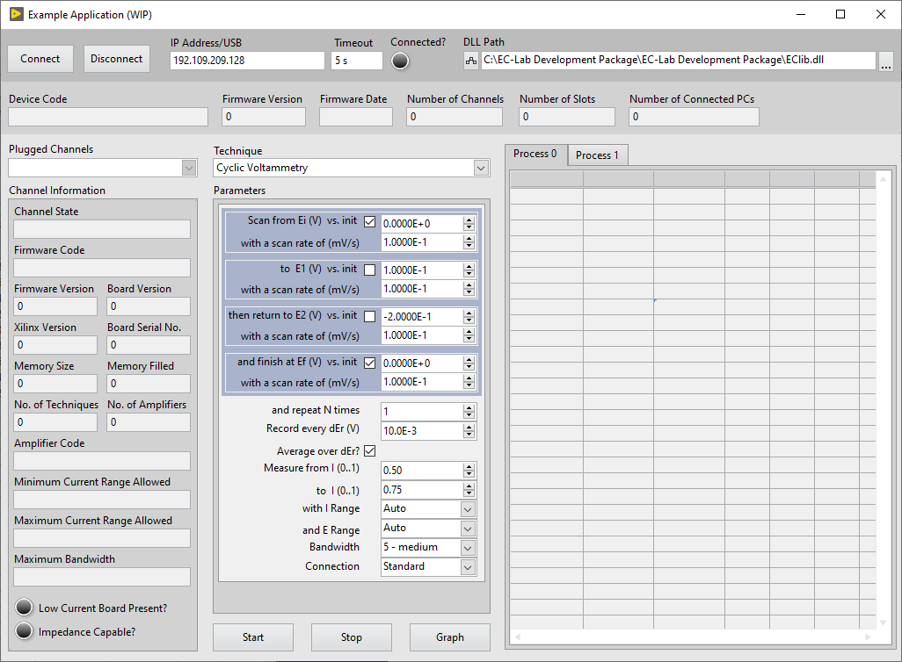

# Unofficial LabVIEW Driver for EC-Lab BioLogic Potentiostats
Unoffcial LabVIEW driver for BioLogic potentiostats/galvanostats designed for ease of intergration to LV projects. I stress that this is designed for intergration and thus it is not a complete LabVIEW out of the box solution. This means you will need the [EC-Lab OEM Development Package](https://www.biologic.net/support-software/ec-lab-oem-development-package/) along side you as well as an understanding of the documentation provided with it to get up and running. 

With that said, getting started is fairly straightforward. The driver follows this pattern:

<b> Connect ➡ Set Channel ➡ Load Technique ➡ Start ➡ Acquire Data ➡ Process Data ➡ Stop ➡ Disconnect</b>

You can open the Main.vi VI to see an example of how it works at a higher level.

**Connect.vi** handles initalisation and connects to the instrument.

Loading a Technique is also fairly simple. Just set the channel you want to work on using **Set Channel.vi**, connect the type-def associated with the technique you wish to use to the Technique Parameters terminal of the **Load Technique.vi** VI and select your technique on the enum. The **Load Technique.vi** VI will check to see if you connected a valid and supported technique then format the parameters accordingly, if the check is passed. If your device fails the check, an error will be produced and will propagate throughout the error wire. 

**Start Channel.vi** starts the aquisition on the specified channel.

The **Acquie Data.vi** VI will return the channel data with minimal processing. This data is hard to read unless you have the documention located on the [EC-Lab OEM Development Package](https://www.biologic.net/support-software/ec-lab-oem-development-package/) . The output is a cluster containing the meta-data for the data (Data Information), Current Values and Process Data. This is for you to implement you own custom processing solution. There is a built-in processing solution in the form of a VI called **Process Data.vi**. This VI will not only output the column header text, but it will also do additional maths such as producing extra columns for -Im(Z) and Re(Z) used for Nyquist plots in the PEIS technique.

**Stop Channel.vi** stops the aquisition on the specified channel.

**Disconnet.vi** cleans and disconnects the instrument.

**NOTE:** Not all devices and techniques are supported.

# Minimum Requirements
* LabVIEW 2018 (32-bit) or above
* [EC-Lab OEM Development Package](https://www.biologic.net/support-software/ec-lab-oem-development-package/)

**NOTE:** 64-bit LabVIEW is not supported. See [Issue #1](https://github.com/fisothemes/Unofficial-LabVIEW-Driver-for-EC-Lab-BioLogic-Potentiostats/issues/1) for further details

# Supported Techniques
* OCV - Open Circuit Voltage
* CV - Cyclic Voltammetry
* CA - Chronoamperometry
* CP - Chronopotentiometry
* PEIS - Potentio Electrochemical Impedance Spectroscopy
* GEIS - Galvano Electrochemical Impedance Spectroscopy

# Supported Devices

* VMP3 series - theoretically should be supported
* SP-300 series - not supported, a little extra work is needed to add support for these. I don't have access to this hardware. The Connect.vi VI will detect these and produce an error. 

# Developer Notes

Please feel free to contribute to the project. For unsupported Techniques/Devices I am happy to try and add them on request. However, I will do this on my spare time and will not adhere to any deadlines, nor will I accept any form of payment. This is just a hobby 😊.

I am also happy to answer any questions regarding the software architecture of this driver to the best of my knowledge.

# Showcase

# Example 1 - Single Channel Acquisition 

**Single Channel Acquisition.vi:**
 

# Example 2 - Multi-Channel Aquisition
**Multi-Channel Acquisition.vi:**
 

Acquiring data from more than 1 channel takes advantage of LabVIEW's data flow model and OOP. Each branch is a copy of the object at that point. For more information on OOP and Dataflow see NI's documentation titled [LabVIEW Object-Oriented Programming: The Decisions Behind the Design](https://www.ni.com/en-gb/support/documentation/supplemental/06/labview-object-oriented-programming--the-decisions-behind-the-de.html).

You can wrap the duplicate code on the block diagram above in a reentrant SubVI and launch it asynchronously. This will achieve the same results.

In the future I wish to create an abstraction layer for multi-channel aquisition. I have a few ideas I'm mulling over.

# Example 3 - Application (WIP)
**Application (WIP).vi:**

This a the front panel of an example VI that I will be building over sometime to serve as a proper showcase on how to properly utilise the drivers. As long as the (WIP) flag is showing on the VI's name, the VI will not be complete. Currently it's just front panel controls. There is no date I can supply as to when it will be finished.

As always, feel free to contribute.

- - - -
